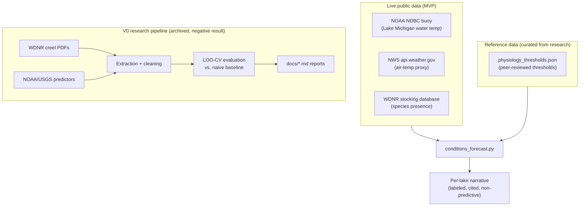

# 🎣 fishin

**Can Wisconsin fishing conditions be predicted from public data?**
A research project that tried to find out — with real statistical rigor, honest
negative results, and a working MVP built on what actually held up.

[](https://github.com/jsopa1/fishin/actions/workflows/tests.yml)
[](LICENSE)
[](pyproject.toml)

---

## The short version

This project set out to answer a simple question with a not-so-simple answer:
*does public data (weather, water conditions, fish biology, angler records)
predict how good the fishing will be?*

Five research cycles, ~60 unit tests, and thousands of real rows of
government data later, the honest answer for **catch-rate prediction** is
**no — not with the data available today.** That negative result is reported
in full, with every number and every dead end, because a study that only
publishes its wins isn't a study you can trust.

Rather than force a positive result or quietly abandon the project, it
**pivoted** to something the evidence actually supports: a live,
science-backed "conditions & biology" tool that tells an angler what's
biologically happening on a lake right now — without ever pretending to
predict whether they'll catch a fish.

## Why this repo is worth a look

- **Real methodology, not a toy dataset.** Every number in every report
  traces to a live government source — WDNR creel surveys (parsed from
  actual PDFs), NOAA buoys, USGS gauges, NWS weather, peer-reviewed fisheries
  science — fetched, extracted, and cited, not simulated.
- **Statistically honest.** Every evaluation uses leave-one-out
  cross-validation, explicit baseline comparisons, and multiple-comparisons
  awareness. When a correlation looked significant but didn't survive
  held-out testing, that's reported as the headline finding, not buried.
  See [`docs/v0_inland_predictability_results.md`](docs/v0_inland_predictability_results.md)
  for a textbook example of exactly that.
- **A real research journey, documented as it happened.** [`DECISIONS.md`](DECISIONS.md)
  is a running decision log — twelve entries, each with rationale, tracking
  every scope change, pivot, and dead end from "predict Wisconsin catch
  rates" through a GLATOS telemetry detour to the live MVP that shipped.
- **It ships something real.** [`mvp/conditions_forecast.py`](mvp/conditions_forecast.py)
  is a working script that hits three live public APIs and prints an honest,
  labeled, science-cited narrative — not a mockup.

## What changed, and why (the pivot story)

| Phase | What it tried | What happened |
|---|---|---|
| **V0** | Predict Lake Michigan / inland-lake catch rate from weather, wave height, lake characteristics | No candidate showed real held-out signal beyond one unreplicated, causally-uncertain result (yellow perch vs. wave height) — [full report](docs/V0_FEASIBILITY_REPORT.md) |
| **V0 extension** | Widen the inland-lake search statewide; test whether a model trained on one lake transfers to a similar lake | Found 11 more lakes with real creel data, but zero validated cross-lake transfer pairs — [full report](docs/v0_lake_transfer_report.md) |
| **V0 extension** | Pool all 11 inland lakes together (more data = more power?) | Still no signal, tested with leave-one-lake-out CV against two baseline types — [full report](docs/v0_inland_predictability_results.md) |
| **V0 extension** | Try established fish physiology (spawning triggers, thermal preferences) instead of weather | An even cleaner null result — and the single best-evidenced hypothesis (dawn/dusk feeding) turned out to be *untestable*, not disproven, because the outcome data has no trip-level timestamp — [full report](docs/v0_physiology_predictors_report.md) |
| **V1 (considered)** | Pivot to Great Lakes acoustic telemetry (GLATOS) for real-time salmon tracking | Investigated and **deferred**: telemetry data is retrospective by months, coverage is confounded by tag battery life, and it doesn't solve the underlying problem — see `DECISIONS.md` #011 |
| **MVP (shipped)** | Stop trying to predict catch rate. Report live, cited, science-based conditions instead | Working script pulling 3 live public data sources — see below |

Every one of those "what happened" columns is a link to a full write-up with
real numbers, not a summary that trusts you to take it on faith.

## The MVP

```bash
python mvp/conditions_forecast.py --lake "Pewaukee Lake" --county Waukesha --lat 43.0189 --lon -88.2359
```

Live output, right now:

```
**Current temperature reading:** 69.8°F / 21.0°C (an air-temperature PROXY, not a direct water-temperature measurement).
Source: NWS current air temperature, used as a proxy — not a water-temperature measurement [station KUES].

**Species with a confirmed WDNR stocking record for this lake** (3): Muskellunge, Northern Pike, Walleye

### Walleye
- Water temperature is currently within the documented activity/feeding-temperature window
  (55-75°F / 12.8-23.9°C) — general feeding/activity range, with a field-measured preference
  point of 20.6°C (69°F) from Trout Lake, Wisconsin. (Evidence quality: solid field telemetry
  + WI-specific field value)
```

Three real, live public data sources, no API keys, no scraping shortcuts:

1. **Current conditions** — a real NOAA buoy reading for Lake Michigan, or an
   explicitly-labeled NWS air-temperature proxy elsewhere (never blurred
   together — the output always says which one you got)
2. **Fish physiology thresholds** — [`mvp/physiology_thresholds.json`](mvp/physiology_thresholds.json),
   compiled from peer-reviewed literature and a Great Lakes Fishery
   Commission field-data compilation
3. **Species presence** — a live query against WDNR's actual fish-stocking
   database (reverse-engineered from their public search tool's own AJAX
   calls), so the tool never invents a species that isn't actually stocked
   in that lake

Every output is explicitly labeled *"general, science-based seasonal
context — not a catch prediction."* That line isn't boilerplate; it's the
whole design constraint the pivot was built around.

## Architecture



## Repository structure

```
mvp/                    The shipped tool — conditions_forecast.py + tests + reference data
analysis/                V0 evaluation scripts (LOO-CV, baseline comparisons) + tests
data/v0/                 Real extracted datasets: creel PDFs, NOAA/USGS series, stocking records
docs/                    Every research report, in full — the evidentiary record
  V0_FEASIBILITY_REPORT.md          Lake Michigan / inland-lake catch-rate feasibility
  v0_lake_transfer_report.md        Cross-lake predictor transfer test
  v0_inland_predictability_results.md   Pooled inland-lake predictability test
  v0_physiology_predictors_report.md    Fish-physiology predictor test
DECISIONS.md              The full decision log — every pivot, with rationale
STATE.md                  Current status, in the style of a living project journal
tests/                    Core utility tests
```

## Methodology this project holds itself to

- **No claim outlives its evidence.** [`DECISIONS.md`](DECISIONS.md) #005:
  *"the system must never represent an arbitrary score as scientifically
  validated."* Every report in `docs/` is written against that rule, not
  around it.
- **Held-out validation, always.** Every predictor tested here goes through
  leave-one-out cross-validation against an explicit naive baseline — a
  correlation alone was never treated as a finding (and one place where that
  distinction visibly mattered is called out directly in the inland
  predictability report).
- **Negative results are results.** Four full research cycles came back null
  or near-null. All four are published in full, not summarized away.
- **Real data or nothing.** No synthetic rows, no estimated values presented
  as measurements — every gap in coverage is disclosed as a gap, not padded.

## Quickstart

```bash
python -m venv .venv
source .venv/bin/activate   # or .venv\Scripts\activate on Windows
pip install -e ".[dev]"

# Run every test suite (core utilities, V0 analysis, MVP)
python -m pytest

# Try the MVP against a real Wisconsin lake
python mvp/conditions_forecast.py --lake "Devils Lake" --county Sauk --lat 43.4258 --lon -89.7304
```

## Tech stack

Python · pandas / numpy / scipy for statistical evaluation · stdlib
`urllib` for zero-dependency live API calls in the MVP · `pytest` /
`unittest` · real government open-data APIs (WDNR, NOAA NDBC/CO-OPS, USGS
NWIS, NWS) · no paid services, no API keys required anywhere in this repo.

## How this was built

This project was developed through disciplined, human-reviewed AI-agent
orchestration — each research cycle scoped, executed, and gated behind
explicit review before the next one began. `DECISIONS.md` is the literal
audit trail of that process: every scope change is a numbered, dated
decision with its own rationale, not a rewritten history.

## License

[MIT](LICENSE)
