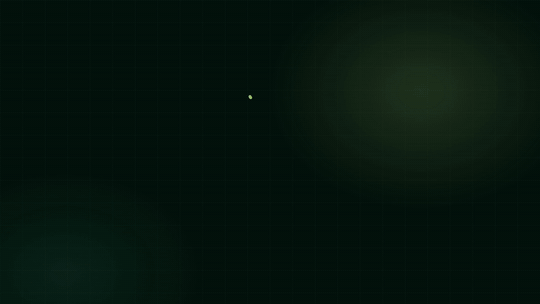
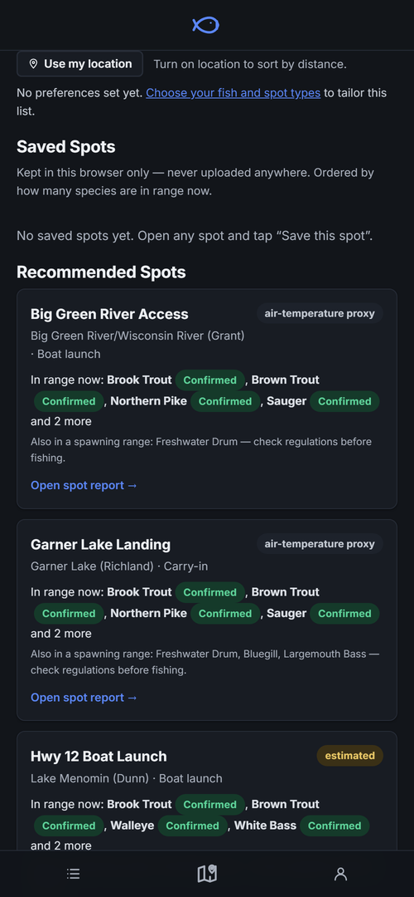
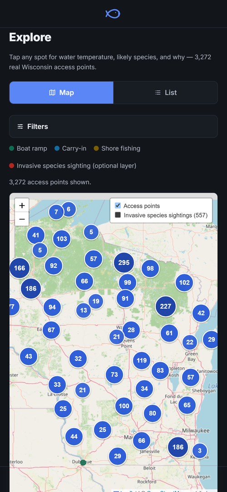
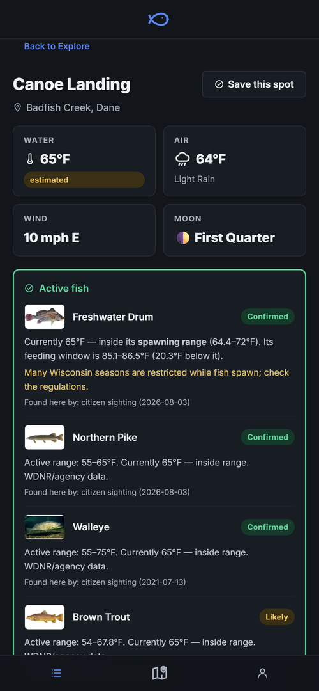
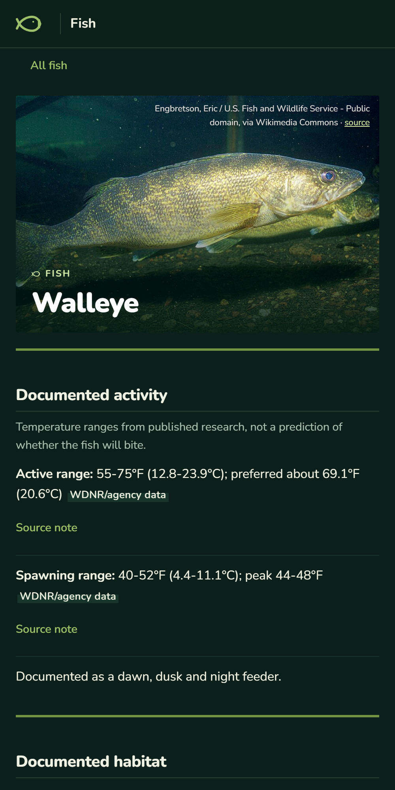
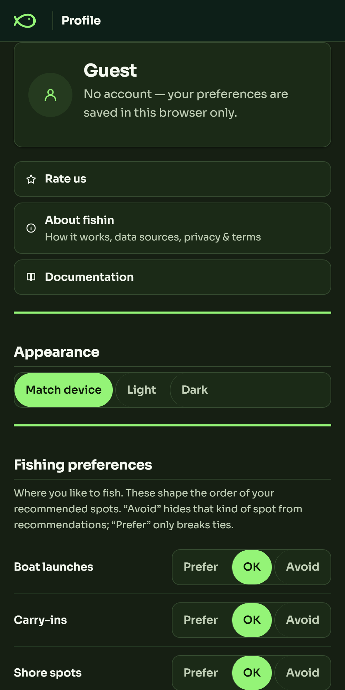
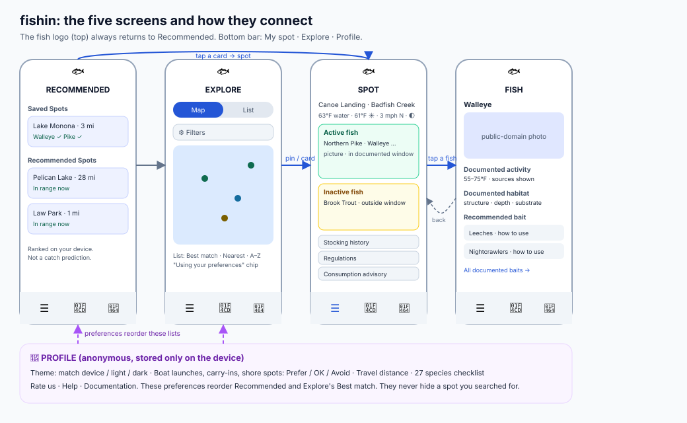
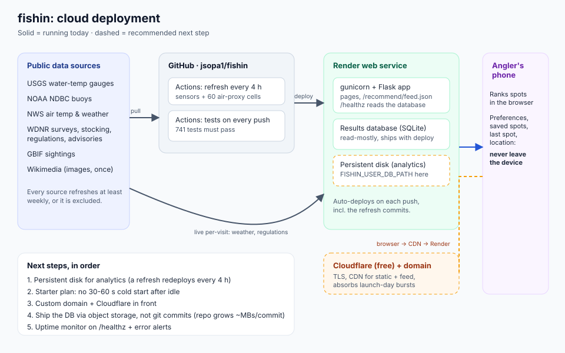
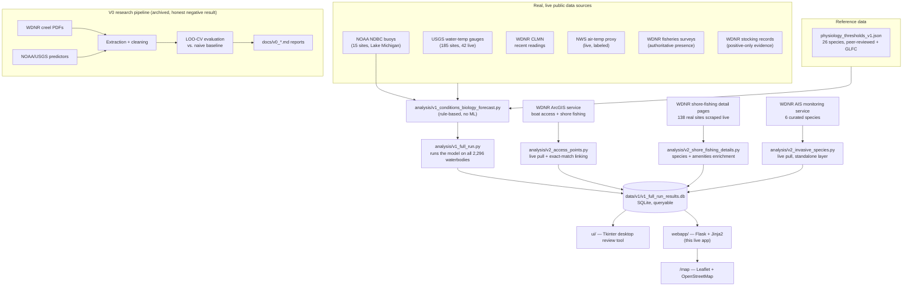

<div align="center">

# 🎣 fishin

### Which Wisconsin fish are in their range right now, and why.

Live water temperature from real sensors, checked against published fish research, at **3,272 public access points**.<br>
Every answer shows its source. It reports conditions. It never predicts a catch.

[](https://github.com/jsopa1/fishin/actions/workflows/tests.yml)
[](LICENSE)
[](pyproject.toml)
[](#tests)
[](DECISIONS.md)

<a href="videos/fishin-launch/renders/fishin-launch.mp4">
  
</a>

<sub>▶ Plays automatically · <a href="videos/fishin-launch/renders/fishin-launch.mp4"><b>watch the full-quality film (MP4, 47 s)</b></a></sub>

**[The five screens](#the-five-screens)** · **[What makes it different](#what-makes-it-different)** · **[Quickstart](#quickstart)** · **[Documentation](#documentation)** · **[Deploy it](DEPLOY.md)** · **[The story](#the-story-v0--v1)**

</div>

---

## What it is

A mobile-first web app for Wisconsin anglers. Pick a spot, see which documented species are inside their temperature
range right now, and open any fish for its habitat and the baits agencies recommend.

- **3,272** real WDNR boat launches, carry-ins and shore spots, each with a temperature, always labelled *real measurement*, *estimated* or *air-temperature proxy*
- **27 species** with documented temperature ranges, habitat and bait, every claim cited, every fish with a public-domain photo and every bait with a picture
- **Sensors refresh every four hours.** Anything that cannot be refreshed at least weekly is not in the app
- **No account, no tracking.** Preferences, saved spots and your location stay on your device; the ranking runs in your browser

It is **not** a catch predictor. An earlier phase of this project (V0) spent five independent research cycles trying to
predict catch rate from public data and reported honestly that it could not be done. The app is what the evidence
*does* support. See [the story](#the-story-v0--v1).

## The five screens

<p align="center">
  
  
  
  
  
</p>

| Screen | What you get |
|---|---|
| **Recommended** | Your saved spots, then spots ranked by how many of your species are in range now. A fixed, disclosed rule, run on your device |
| **Explore** | Map or list, then filters. The list sorts by Best match, Nearest or A to Z |
| **Spot** | Water, air, wind and moon; **Active** fish (green) and **Inactive** fish (yellow) with the evidence for each; stocking, regulations and consumption advisory one tap away |
| **Fish** | Documented activity range, habitat, and recommended bait with how to use it |
| **Profile** | Light or dark, Prefer / OK / Avoid per spot type, travel distance, the species you target. Stored only on the device |

The fish logo always returns to Recommended; the bottom bar is **My spot · Explore · Profile**. The same phone design is used at every screen width.

<p align="center">
  
</p>

## What makes it different

| | |
|---|---|
| **Evidence, not vibes** | Each fish row is tagged *Confirmed* (a WDNR survey or a dated sighting) or *Likely* (stocked, or recorded in the county). Tap any tag for what it means |
| **A disclosed ranking** | Species in range, then evidence strength, spot type you prefer, reading quality, distance. No weights, no randomness, [tested under Node](webapp/tests/test_recommend_js.py) |
| **Honest gaps** | Where a source is missing the page says so. Cisco has no bait listed rather than a guessed one; Lake Sturgeon has no feeding window because only hatchery studies exist |
| **Private by design** | The server publishes one feed that is identical for everyone; ranking happens in your browser. Your location is never sent |
| **Verbatim-or-nothing research** | Every habitat, bait and temperature claim carries the exact source sentence, and builders refuse to write a claim they cannot find in the source |
| **Open decision log** | [56 dated entries](DECISIONS.md), including the ones that reversed course |

## Quickstart

```bash
git clone https://github.com/jsopa1/fishin.git
cd fishin
python -m venv .venv && source .venv/bin/activate   # .venv\Scripts\activate on Windows
pip install -e ".[dev]"

python webapp/app.py
# → open http://127.0.0.1:5000
```

That's it — no API keys, no external services to configure, no database to set up. The app reads directly from a committed, real, already-generated SQLite database (`data/v1/v1_full_run_results.db`) built from live WDNR/USGS/NWS data.

Deployment-ready for [Render](https://render.com)'s free tier out of the box — `render.yaml` is included; see [`webapp/README.md`](webapp/README.md) for the one-click path.

## Documentation

| Read this | For |
|---|---|
| [`docs/README.md`](docs/README.md) | The index of every research report, plan and design doc |
| [`docs/deployment_architecture.md`](docs/deployment_architecture.md) · [`DEPLOY.md`](DEPLOY.md) | How it runs in the cloud, what breaks first, and the ten-minute launch checklist |
| [`docs/marketing/feature_messaging.md`](docs/marketing/feature_messaging.md) | Positioning, feature copy and launch posts (with the words we never use) |
| [`docs/v4_ux_goal_loop_spec.md`](docs/v4_ux_goal_loop_spec.md) · [`UX/`](UX) | The redesign spec and the wireframes it was built from |
| [`docs/project_history_and_features.md`](docs/project_history_and_features.md) | How each phase was built, kept in full |
| [`DECISIONS.md`](DECISIONS.md) · [`ROADMAP.md`](ROADMAP.md) · [`STATE.md`](STATE.md) | Every decision, the phase plan, and where things stand |
| [`videos/fishin-launch/`](videos/fishin-launch) | Source of the launch film ([HyperFrames](https://hyperframes.heygen.com) HTML composition) |

## Deploying it

One small web service and one scheduled job: Flask on [Render](https://render.com) (`render.yaml` is included) plus a
four-hourly GitHub Action that refreshes the sensor readings. There is no database server, queue or login to run.
[`docs/deployment_architecture.md`](docs/deployment_architecture.md) has the diagram, the known gaps (a persistent disk for analytics,
the free-tier cold start) and the order to fix them.

<p align="center">
  
</p>

## Architecture



## The Story: V0 → V1

| Phase | What it tried | What happened |
|---|---|---|
| **V0** | Predict Lake Michigan / inland-lake catch rate from weather, wave height, lake characteristics | No candidate showed real held-out signal beyond one unreplicated, causally-uncertain result — [full report](docs/V0_FEASIBILITY_REPORT.md) |
| **V0 ext.** | Widen the inland-lake search statewide; test cross-lake predictor transfer | 11 more lakes with real creel data found, zero validated transfer pairs — [full report](docs/v0_lake_transfer_report.md) |
| **V0 ext.** | Pool all inland lakes together (more data = more power?) | Still no signal under leave-one-lake-out CV — [full report](docs/v0_inland_predictability_results.md) |
| **V0 ext.** | Try established fish physiology instead of weather | An even cleaner null — and the single best-evidenced hypothesis turned out to be *untestable*, not disproven, since the outcome data had no trip-level timestamp — [full report](docs/v0_physiology_predictors_report.md) |
| **V1 (considered)** | Pivot to real-time acoustic telemetry (GLATOS) for salmon tracking | Investigated and **deferred** — retrospective-only data, confounded coverage — [`DECISIONS.md` #011](DECISIONS.md) |
| **V1 (shipped)** | Stop trying to predict catch rate. Report real conditions vs. real biology instead | The app in this repo. Scaled statewide, validated at 2,296-waterbody scale, polished, and deployed. |

Every "what happened" cell links to a full write-up with real numbers — **[`DECISIONS.md`](DECISIONS.md) has 56 dated, rationale-backed entries** tracking every pivot from "predict Wisconsin catch rates" through the GLATOS detour to the app that shipped, and on into V2.

## Methodology this project holds itself to

- **No claim outlives its evidence.** [`DECISIONS.md`](DECISIONS.md) #005: *"the system must never represent an arbitrary score as scientifically validated."* Every report and every line of app copy is written against that rule.
- **Held-out validation, always.** Every V0 predictor went through leave-one-out cross-validation against an explicit naive baseline — a correlation alone was never treated as a finding.
- **Negative results are results.** Four full V0 research cycles came back null or near-null. All four are published in full.
- **Positive-only evidence stays positive-only.** Stocking records confirm presence; they are never used to infer absence.
- **Real data or nothing.** No synthetic rows, no estimated values presented as measurements — every gap in coverage is disclosed as a gap.

## Tests

```bash
python -m pytest
```

**760+ tests** across `tests/`, `analysis/tests/`, `mvp/tests/`, `ui/tests/`, and `webapp/tests/` — statistical helper functions, real-data-quality regression tests (the exact duplicate-lake and species-casing bugs described above), Flask route tests, and error-handling paths. CI runs the full suite on every push via GitHub Actions.

## Built with Claude Code

This project (research, statistics, pipelines, the app, its tests and its deployment) was built through iterative
sessions with [Claude Code](https://claude.com/claude-code). Every phase was scoped, executed and gated behind review,
negative results shipped in full, and real bugs were found by running the thing at scale. The interesting part is
usually [`DECISIONS.md`](DECISIONS.md) and the `docs/*_report.md` series. The longer account is in
[`docs/project_history_and_features.md`](docs/project_history_and_features.md#built-with-claude-code).

## Repository structure

```
webapp/          The app: Flask routes, Jinja templates, static JS/CSS, and its tests
ui/              Data-access layer shared by the app, the feed builder and the desktop review tool
analysis/        The rule-based model, batch runner, data pullers, research builders and their tests
data/v1/         The committed results database plus the reference data (thresholds, habitat, bait,
                 image manifest) and the raw source texts the research is checked against
docs/            Research reports, plans, diagrams, marketing copy and screenshots (see docs/README.md)
UX/              The five wireframes the V4 redesign was built from
videos/          The launch film: a HyperFrames composition and its render
mvp/, tests/     The original single-lake proof of concept and its tests (superseded)
DECISIONS.md     The decision log: every pivot, with rationale
render.yaml      One-file Render blueprint
```

## Tech stack

Python · Flask + Jinja2 (web app) · Leaflet + OpenStreetMap (V2 map, no API key) · Tkinter + PyInstaller (desktop review tool) · SQLite (queryable results store) · pandas / numpy / scipy (V0 statistical evaluation) · stdlib `urllib` for zero-dependency live API calls · pytest · real government open-data APIs (WDNR, USGS NWIS, NOAA NDBC/CO-OPS, NWS, WDNR ArcGIS) — no paid services, no API keys required anywhere in this repo.

## License

[MIT](LICENSE)
