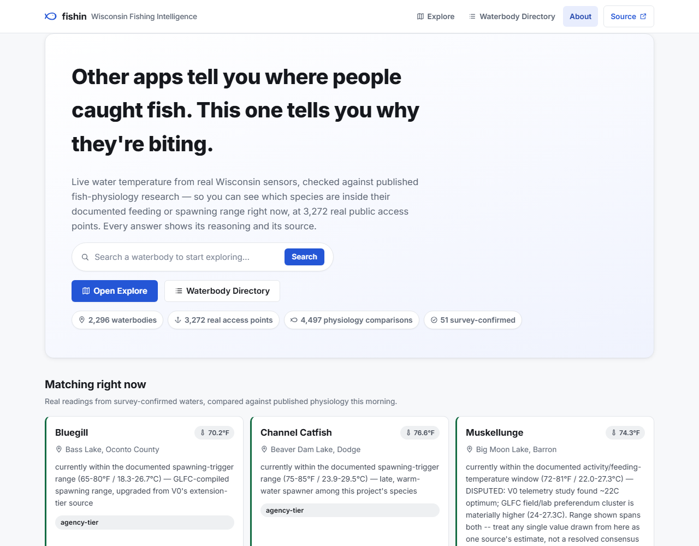
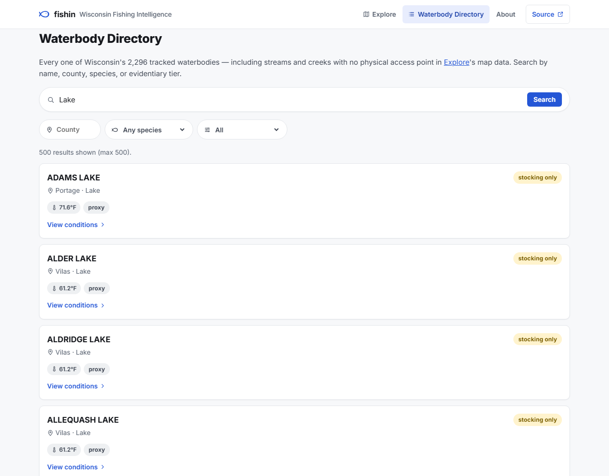
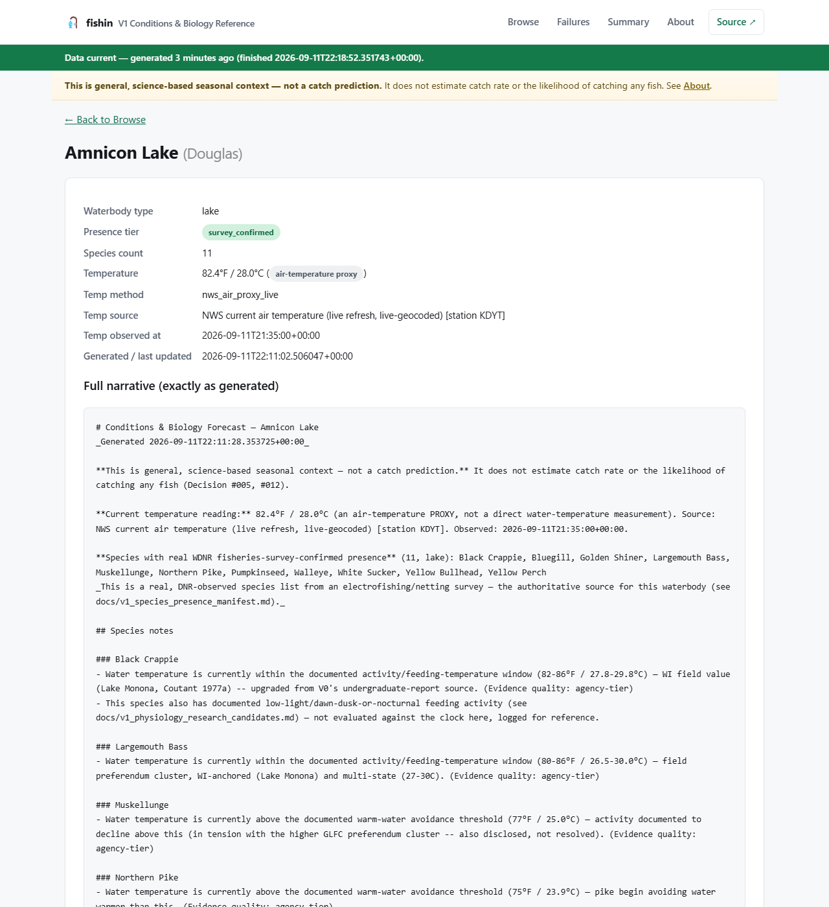
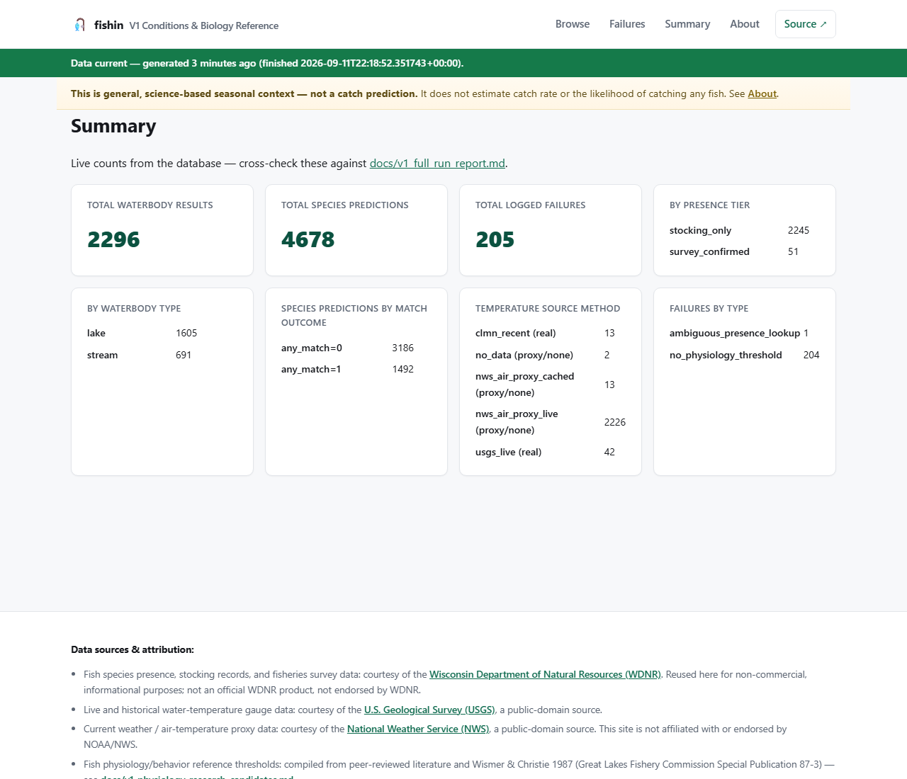
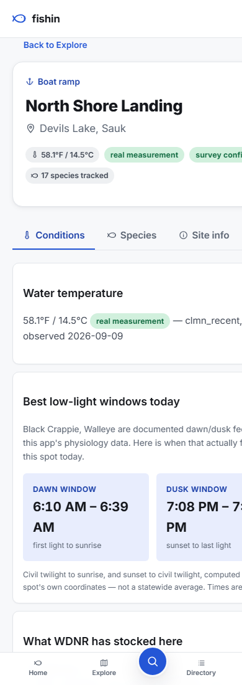
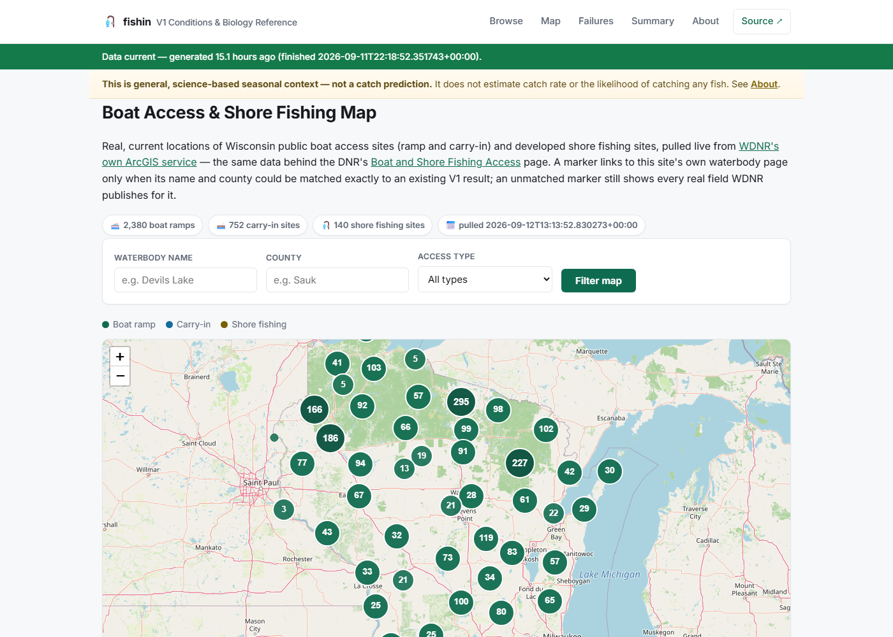
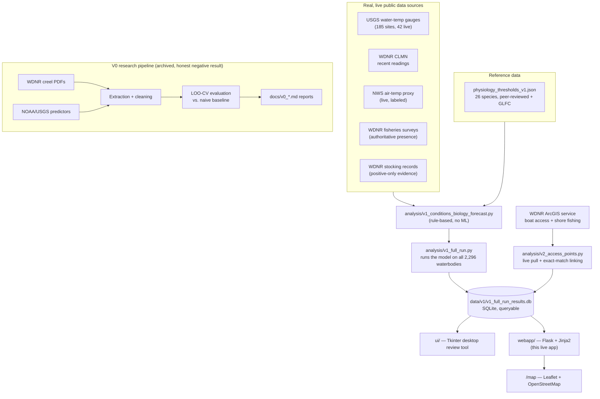

# 🎣 fishin

**A statewide Wisconsin fishing conditions & biology reference — built end-to-end with [Claude Code](https://claude.com/claude-code).**
Real government data, real statistical rigor, an honest negative result that reshaped the whole project, and a polished web app to show for it.

[](https://github.com/jsopa1/fishin/actions/workflows/tests.yml)
[](LICENSE)
[](pyproject.toml)
[](#tests)

---

### ▶ [Live demo ↗](https://nascar-leather-lessons-width.trycloudflare.com) · [Screenshots](#screenshots) · [The full story](#the-story-v0--v1) · [Built with Claude Code](#built-with-claude-code)

*The live demo link runs from a temporary local tunnel and may go offline between visits — see [Quickstart](#quickstart) to run it yourself if the link is down.*

---

## What this is

A web app that answers one honest, narrow question for any of **2,296 real Wisconsin lakes, ponds, rivers, and streams**: *right now, is the water temperature inside a documented physiological window — spawning trigger, feeding-activity range — for a species actually confirmed present here?*

It is **not** a catch-rate prediction. That distinction isn't marketing copy — it's the direct output of a earlier phase of this project (V0) that spent five independent research cycles trying to statistically predict catch rate from public data, and honestly reported that it couldn't be done with the data available. Rather than ship an overclaimed product, the project pivoted to something the evidence actually supports, and built that instead.

<p align="center">
  
</p>

## Quickstart

```bash
git clone https://github.com/jsopa1/fishin.git
cd fishin
python -m venv .venv && source .venv/bin/activate   # .venv\Scripts\activate on Windows
pip install -e ".[dev]"

python webapp/app.py
# → open http://127.0.0.1:5000
```

That's it — no API keys, no external services to configure, no database to set up. The app reads directly from a committed, real, already-generated SQLite database (`data/v1/v1_full_run_results.db`) built from live WDNR/USGS/NWS data.

Deployment-ready for [Render](https://render.com)'s free tier out of the box — `render.yaml` is included; see [`webapp/README.md`](webapp/README.md) for the one-click path.

## Screenshots

| Search & filter | Full detail, every caveat shown |
|---|---|
|  |  |

| Live summary stats | Mobile-responsive |
|---|---|
|  |  |

**V2, in progress:** a statewide, clustered map of 3,272 real WDNR boat access and shore fishing sites, each linked to its waterbody's V1 conditions page where a confident match exists.

<p align="center">
  
</p>

## The Story: V0 → V1

| Phase | What it tried | What happened |
|---|---|---|
| **V0** | Predict Lake Michigan / inland-lake catch rate from weather, wave height, lake characteristics | No candidate showed real held-out signal beyond one unreplicated, causally-uncertain result — [full report](docs/V0_FEASIBILITY_REPORT.md) |
| **V0 ext.** | Widen the inland-lake search statewide; test cross-lake predictor transfer | 11 more lakes with real creel data found, zero validated transfer pairs — [full report](docs/v0_lake_transfer_report.md) |
| **V0 ext.** | Pool all inland lakes together (more data = more power?) | Still no signal under leave-one-lake-out CV — [full report](docs/v0_inland_predictability_results.md) |
| **V0 ext.** | Try established fish physiology instead of weather | An even cleaner null — and the single best-evidenced hypothesis turned out to be *untestable*, not disproven, since the outcome data had no trip-level timestamp — [full report](docs/v0_physiology_predictors_report.md) |
| **V1 (considered)** | Pivot to real-time acoustic telemetry (GLATOS) for salmon tracking | Investigated and **deferred** — retrospective-only data, confounded coverage — [`DECISIONS.md` #011](DECISIONS.md) |
| **V1 (shipped)** | Stop trying to predict catch rate. Report real conditions vs. real biology instead | The app in this repo. Scaled statewide, validated at 2,296-waterbody scale, polished, and deployed. |

Every "what happened" cell links to a full write-up with real numbers — **[`DECISIONS.md`](DECISIONS.md) has 17 dated, rationale-backed entries** tracking every pivot from "predict Wisconsin catch rates" through the GLATOS detour to the app that shipped, and on into V2.

## What the app actually does

For each of 2,296 real waterbodies, the same rule-based logic (no black box — [read it](analysis/v1_conditions_biology_forecast.py)) runs:

1. **Real current water temperature** — a live USGS gauge where one exists, a recent WDNR Citizen Lake Monitoring Network reading, or an explicitly-labeled NWS air-temperature proxy. Never blended, always labeled.
2. **Real species presence** — WDNR fisheries-survey data where it exists (authoritative), WDNR stocking records otherwise (used only as *positive* evidence — a species absent from stocking records is never treated as absent from the lake).
3. **Real, cited physiology thresholds** — 26 species, sourced from peer-reviewed literature and a Great Lakes Fishery Commission compilation. Where two sources genuinely disagree (Muskellunge's thermal optimum), **both numbers are shown, not averaged away**.

The result — a narrative like *"water temperature is currently within Walleye's documented spawning-trigger range"* — is stored per waterbody/species and browsable through the web app: search by name, county, species, or evidentiary tier; every caveat, source, and timestamp shown in full, never simplified.

## The V2 access-point map

[`analysis/v2_access_points.py`](analysis/v2_access_points.py) pulls Wisconsin's real public boat access and shore fishing site locations live from [WDNR's own ArcGIS service](https://dnr.wisconsin.gov/topic/lands/boataccess) — 3,135 boat access sites (ramp + carry-in) and 142 shore fishing sites, each with a real lat/lon, waterbody name, county, and (for boat access) ADA-accessibility and ownership. The [`/map`](webapp/templates/map.html) page plots all of it on a Leaflet + OpenStreetMap map (clustered for performance, auto-zooms to a filtered result), filterable by county, waterbody, or access type. A marker links back to its waterbody's V1 conditions page only when its name and county match an existing result exactly — no fuzzy guessing; an unmatched marker still shows every real field WDNR publishes for it. Full write-up, including a real data source that was investigated and deliberately *not* shipped: [`docs/v2_access_points_report.md`](docs/v2_access_points_report.md).

## Built with Claude Code

This entire project — research, statistical evaluation, data pipelines, the desktop review tool, this web app, and its deployment — was built through iterative sessions with **[Claude Code](https://claude.com/claude-code)**, Anthropic's agentic CLI. A few things about *how* it was built are worth calling out for anyone evaluating this as a development-process sample, not just a code sample:

- **Every phase was scoped, executed, and gated behind explicit review** before the next began — [`DECISIONS.md`](DECISIONS.md) is the literal, unedited audit trail: 17 numbered decisions, each with its own rationale, including the ones that reversed course.
- **Negative results were kept, not massaged.** Four independent statistical research cycles came back null. All four shipped in full, because that's what actually happened.
- **Real bugs were found by actually running the thing at scale**, not just code review. Running the model across all 2,296 waterbodies (not a handful of demo cases) surfaced two silent, previously-undetected defects — a species-name casing mismatch that meant survey-confirmed matches had *never* actually fired in any prior demo, and a county-naming inconsistency that produced duplicate lake entries (caught by literally looking at the app's own output afterward and noticing "Devils Lake" listed twice). Both are documented, fixed, and regression-tested — see [`docs/v1_full_run_report.md`](docs/v1_full_run_report.md).
- **The UI polish pass was criteria-driven and verified, not vibes-based** — 7 explicit criteria (responsive layout, functional correctness, error handling, performance, honesty of framing, accessibility, attribution), each checked with a real measurement (`scrollWidth` diffs across 3 real viewport widths, WCAG contrast ratios computed and one failure fixed, all 516 interactive elements confirmed keyboard-focusable, live-database query timings) before being marked done. See [`docs/v1_polish_report.md`](docs/v1_polish_report.md).
- **A real data source was investigated and deliberately not shipped, in V2.** WDNR also publishes a lake-polygon layer that could give real per-lake surface acreage — but it has no county field, and a live test query for "Devils Lake" returned a polygon 300+ miles from the one this app's data actually covers (the exact same-name collision V1 had already hit once). Rather than ship a lower-confidence match, it's documented as deferred pending a proper ID-based join — see [`docs/v2_access_points_report.md`](docs/v2_access_points_report.md) §2.

If you're reviewing this as a portfolio piece: the interesting part usually isn't any single file, it's `DECISIONS.md` and the `docs/v1_*_report.md`/`docs/v2_*_report.md` series read in order — a real, unedited record of an AI-assisted engineering process that included wrong turns, self-caught bugs, and a project pivot driven by honest negative results.

## Architecture



## Repository structure

```
webapp/                 The live app — Flask backend, Jinja2 templates, deployment config
ui/                      Shared data-access layer + the Tkinter desktop review tool (.exe)
analysis/                The rule-based model, the full-scale batch runner, the V2 access-point
                          puller, and the LOO-CV V0 scripts
mvp/                     The original single-lake proof-of-concept script (superseded by webapp/)
data/v0/, data/v1/        Real extracted datasets — creel PDFs, USGS/NOAA series, stocking
                          records, and the queryable results database
docs/                    Every research report and polish/run report, in full
  V0_FEASIBILITY_REPORT.md              V0's core catch-rate feasibility finding
  v1_full_run_report.md                 Full-scale run: real bugs found and fixed
  v1_polish_report.md                   The 7-criteria UI/UX polish pass, honestly scored
DECISIONS.md              The full decision log — every pivot, with rationale
STATE.md / ROADMAP.md     Current status and phase history
render.yaml               One-file Render deployment blueprint
```

## Methodology this project holds itself to

- **No claim outlives its evidence.** [`DECISIONS.md`](DECISIONS.md) #005: *"the system must never represent an arbitrary score as scientifically validated."* Every report and every line of app copy is written against that rule.
- **Held-out validation, always.** Every V0 predictor went through leave-one-out cross-validation against an explicit naive baseline — a correlation alone was never treated as a finding.
- **Negative results are results.** Four full V0 research cycles came back null or near-null. All four are published in full.
- **Positive-only evidence stays positive-only.** Stocking records confirm presence; they are never used to infer absence.
- **Real data or nothing.** No synthetic rows, no estimated values presented as measurements — every gap in coverage is disclosed as a gap.

## Tests

```bash
python -m pytest
```

**197 tests** across `tests/`, `analysis/tests/`, `mvp/tests/`, `ui/tests/`, and `webapp/tests/` — statistical helper functions, real-data-quality regression tests (the exact duplicate-lake and species-casing bugs described above), Flask route tests, and error-handling paths. CI runs the full suite on every push via GitHub Actions.

## Tech stack

Python · Flask + Jinja2 (web app) · Leaflet + OpenStreetMap (V2 map, no API key) · Tkinter + PyInstaller (desktop review tool) · SQLite (queryable results store) · pandas / numpy / scipy (V0 statistical evaluation) · stdlib `urllib` for zero-dependency live API calls · pytest · real government open-data APIs (WDNR, USGS NWIS, NOAA NDBC/CO-OPS, NWS, WDNR ArcGIS) — no paid services, no API keys required anywhere in this repo.

## License

[MIT](LICENSE)
