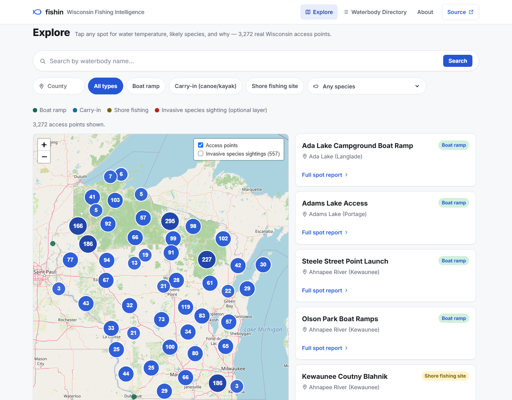
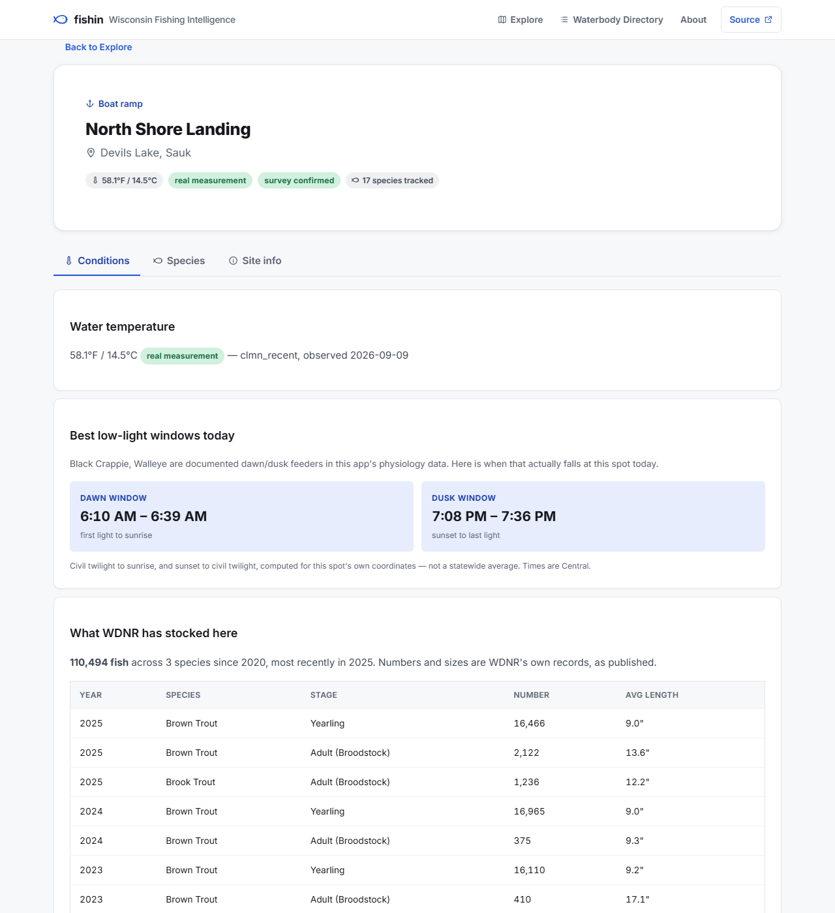
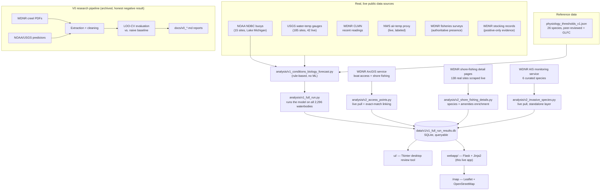

# 🎣 fishin

**A statewide Wisconsin fishing conditions & biology reference — built end-to-end with [Claude Code](https://claude.com/claude-code).**
Real government data, real statistical rigor, an honest negative result that reshaped the whole project, and a polished web app to show for it.

[](https://github.com/jsopa1/fishin/actions/workflows/tests.yml)
[](LICENSE)
[](pyproject.toml)
[](#tests)

---

### ▶ [Screenshots](#screenshots) · [The full story](#the-story-v0--v1) · [Deploy it](DEPLOY.md) · [Built with Claude Code](#built-with-claude-code)

*Not currently hosted anywhere permanent — `render.yaml` is ready and [DEPLOY.md](DEPLOY.md) is a ten-minute walkthrough. To run it locally, see [Quickstart](#quickstart).*

---

## What this is

**Other apps tell you where people caught fish. This one tells you why they're biting.**

A web app that answers one honest, narrow question for any of **2,296 real Wisconsin lakes, ponds, rivers, and streams**: *right now, is the water temperature inside a documented physiological window — spawning trigger, feeding-activity range — for a species actually confirmed present here?*

That gap is real and verified: Wisconsin DNR's own free [Fishing Finder](https://dnr.wisconsin.gov/topic/fishing/outreach/wifishingfinder) already covers access points, stocking and regulations, and the paid apps sell social catch-logging (Fishbrain) or bathymetric charts (Navionics). **None of them tell you why conditions favour a species right now, with the citation.**

It is **not** a catch-rate prediction. That distinction isn't marketing copy — it's the direct output of a earlier phase of this project (V0) that spent five independent research cycles trying to statistically predict catch rate from public data, and honestly reported that it couldn't be done with the data available. Rather than ship an overclaimed product, the project pivoted to something the evidence actually supports, and built that instead.

<p align="center">
  
</p>

## Quickstart

```bash
git clone https://github.com/jsopa1/fishin.git
cd fishin
python -m venv .venv && source .venv/bin/activate   # .venv\Scripts\activate on Windows
pip install -e ".[dev]"

python webapp/app.py
# → open http://127.0.0.1:5000
```

That's it — no API keys, no external services to configure, no database to set up. The app reads directly from a committed, real, already-generated SQLite database (`data/v1/v1_full_run_results.db`) built from live WDNR/USGS/NWS data.

Deployment-ready for [Render](https://render.com)'s free tier out of the box — `render.yaml` is included; see [`webapp/README.md`](webapp/README.md) for the one-click path.

## Screenshots

**Explore** — a split map/list of 3,272 real WDNR access points, filterable by species, county and access type. Clustered so the statewide view stays usable on a phone.

<p align="center">
  
</p>

**A spot report** — the one-stop answer for a single access point: water temperature and how it was obtained, today's low-light windows computed for that exact coordinate, WDNR's stocking record, and the regulations covering that water.

<p align="center">
  
</p>

| Landing | Waterbody Directory | Mobile |
|---|---|---|
|  |  |  |

## The Story: V0 → V1

| Phase | What it tried | What happened |
|---|---|---|
| **V0** | Predict Lake Michigan / inland-lake catch rate from weather, wave height, lake characteristics | No candidate showed real held-out signal beyond one unreplicated, causally-uncertain result — [full report](docs/V0_FEASIBILITY_REPORT.md) |
| **V0 ext.** | Widen the inland-lake search statewide; test cross-lake predictor transfer | 11 more lakes with real creel data found, zero validated transfer pairs — [full report](docs/v0_lake_transfer_report.md) |
| **V0 ext.** | Pool all inland lakes together (more data = more power?) | Still no signal under leave-one-lake-out CV — [full report](docs/v0_inland_predictability_results.md) |
| **V0 ext.** | Try established fish physiology instead of weather | An even cleaner null — and the single best-evidenced hypothesis turned out to be *untestable*, not disproven, since the outcome data had no trip-level timestamp — [full report](docs/v0_physiology_predictors_report.md) |
| **V1 (considered)** | Pivot to real-time acoustic telemetry (GLATOS) for salmon tracking | Investigated and **deferred** — retrospective-only data, confounded coverage — [`DECISIONS.md` #011](DECISIONS.md) |
| **V1 (shipped)** | Stop trying to predict catch rate. Report real conditions vs. real biology instead | The app in this repo. Scaled statewide, validated at 2,296-waterbody scale, polished, and deployed. |

Every "what happened" cell links to a full write-up with real numbers — **[`DECISIONS.md`](DECISIONS.md) has 46 dated, rationale-backed entries** tracking every pivot from "predict Wisconsin catch rates" through the GLATOS detour to the app that shipped, and on into V2.

## What the app actually does

For each of 2,296 real waterbodies, the same rule-based logic (no black box — [read it](analysis/v1_conditions_biology_forecast.py)) runs:

1. **Real current water temperature** — a live USGS gauge where one exists, a live NOAA buoy for Lake Michigan specifically, a recent WDNR Citizen Lake Monitoring Network reading, or an explicitly-labeled NWS air-temperature proxy as a last resort. Never blended, always labeled.
2. **Real species presence** — WDNR fisheries-survey data where it exists (authoritative), WDNR stocking records otherwise (used only as *positive* evidence — a species absent from stocking records is never treated as absent from the lake).
3. **Real, cited physiology thresholds** — 26 species, sourced from peer-reviewed literature and a Great Lakes Fishery Commission compilation. Where two sources genuinely disagree (Muskellunge's thermal optimum), **both numbers are shown, not averaged away**.

The result — a narrative like *"water temperature is currently within Walleye's documented spawning-trigger range"* — is stored per waterbody/species and browsable through the web app: search by name, county, species, or evidentiary tier; every caveat, source, and timestamp shown in full, never simplified. When a species **isn't** a current match, the app says why — e.g. *"currently 8.2°F below the documented activity window"* — instead of a bare "no match" with no explanation.

## The V2 map: access points, species search, and invasive species

[`analysis/v2_access_points.py`](analysis/v2_access_points.py) pulls Wisconsin's real public boat access and shore fishing site locations live from [WDNR's own ArcGIS service](https://dnr.wisconsin.gov/topic/lands/boataccess) — 3,135 boat access sites (ramp + carry-in) and 142 shore fishing sites, each with a real lat/lon, waterbody name, county, and (for boat access) ADA-accessibility and ownership. [`analysis/v2_shore_fishing_details.py`](analysis/v2_shore_fishing_details.py) further enriches every shore-fishing site with real per-site data scraped live from WDNR's own detail pages — available fish species, directions, amenities, ADA accessibility — filling the species-data gap for sites outside V1's waterbody universe.

The [`/map`](webapp/templates/map.html) page plots all of it on a Leaflet + OpenStreetMap map (clustered for performance, auto-zooms to a filtered result), filterable by county, waterbody, access type, **or fish species** — the species filter checks both real sources independently (WDNR's own shore-fishing species list, or a linked V1 waterbody's species data) and never merges or guesses between them. [`analysis/v2_species_canonicalization.py`](analysis/v2_species_canonicalization.py) collapses the 61 real raw species phrases WDNR's own text contains (typos, abbreviations, and all — e.g. `LM BASS`, `SM. MOUTH BASS`, `LAREMOUTH BASS`) into 39 real, deduplicated filter options, without ever altering the raw text shown on the site itself. A **Map/List toggle** switches to a sortable table with an expandable "one-stop-shop" detail row per site — species, directions, stall counts, amenities, ADA info, manager contact — sharing the exact same renderer as the map's popups, so both views always show identical information. A marker links back to its waterbody's V1 conditions page only when its name and county match an existing result exactly — no fuzzy guessing; an unmatched marker still shows every real field WDNR publishes for it.

[`analysis/v2_invasive_species.py`](analysis/v2_invasive_species.py) adds a second, optional map layer: 557 real, WDNR-verified aquatic invasive species sightings (Zebra Mussel, Eurasian Water-Milfoil, Rusty Crayfish, and others) toggled via the map's layer control, off by default. Framed with the same positive-only-evidence rule V1 already applies to stocking data — a sighting is real evidence of a past detection, its absence elsewhere is not evidence a species isn't there.

## The spot-level fishing intelligence platform

Every one of the 3,272 real access points has its own `/spot` page — click a marker or list row, get the whole answer in one place. Each piece is sourced, and each piece says how confident it is:

| On a spot page | Where it comes from |
|---|---|
| **Water temperature** | A real USGS gauge or NOAA buoy where one is close; otherwise an inverse-distance-weighted estimate from real readings within 60 km, carrying a **measured** confidence level; otherwise an honest air-temperature proxy or a plain "no data". A proxy is never used as an interpolation anchor. |
| **Species, and whether conditions favour them** | A two-category dashboard at the top of the page: **Confirmed Sightings** (a WDNR survey or a real citizen sighting actually documented the species) and **Likely species to find** (stocking or county-level evidence only) — a species with real confirming evidence is never also listed as merely likely. Each entry carries an activity read against cited physiology thresholds — inside its documented window, or how far below/above, never just "isn't matching" with no reason. |
| **What WDNR says lives here** | WDNR's own per-lake fish list with abundance (Abundant / Common / Present), kept at their category level and never expanded into species. |
| **Recently reported nearby** | Real, dated, geotagged citizen sightings from [GBIF](https://www.gbif.org/) (iNaturalist "Research Grade" observations — a real person's photo, ID-confirmed by that community), matched by real distance within 8km. A fourth, deliberately weaker evidence tier — shown with the observer's name, a live link to verify the record, and never blended into the temperature match. 9,317 real Wisconsin sightings across 27 species. |
| **Bait & technique** | Keyed to the current thermal state, with the physiological mechanism and the angling convention carried as **separately tiered** claims. |
| **Today's low-light windows** | Dawn and dusk computed astronomically for that exact coordinate, shown only where a species there is a documented low-light feeder. |
| **Stocking history** | 23,870 real WDNR records — year, species, stage, number, average length. |
| **Regulations** | Live from WDNR's own layer, matched **point-in-polygon** rather than by name, shown in their wording with a retrieval time and a verify link. |
| **Consumption advisories** | WDNR site-specific advice, with the stricter limits for women and children kept visually separate. |
| **Wind & barometric pressure** | Live from the same NWS station lookup as the temperature proxy, shown as plain current-conditions text — never scored or compared to a threshold. Peer-reviewed research finds no reliable direct link between pressure and freshwater fish behavior, and this project's own V0 phase found no validated catch-rate signal from weather variables, so this stays informational only, labeled "not used in the match above." |
| **Moon phase** | Requested directly by a real customer. Computed locally (no external API — moon phase is a deterministic function of the date), shown with illumination %. "Solunar theory" has a real following among anglers, but the evidence for a fish-activity effect is mixed and mostly describes tidal/saltwater mechanisms that don't apply to Wisconsin's inland waters — so like wind/pressure, it's labeled a traditional reference, never blended into the match. |

The coordinate matching is not incidental. Wisconsin has eleven unrelated waters named "Devils Lake" with different walleye rules, so name matching could attach one lake's regulations to another — the app resolves by geometry, and where more than one water is in range it names them and refuses to choose.

Full plan and what shipped: [`docs/v2_fish_intelligence_platform_plan.md`](docs/v2_fish_intelligence_platform_plan.md) · bait research: [`docs/v1_bait_technique_research_report.md`](docs/v1_bait_technique_research_report.md) · redesign: [`docs/v2_ux_redesign_report.md`](docs/v2_ux_redesign_report.md).

Full write-up, including real data sources that were investigated and deliberately *not* shipped (with the reasoning behind each): [`docs/v2_access_points_report.md`](docs/v2_access_points_report.md).

## Becoming a product, not just a reference

A later pass closed the gap between "an honest data tool" and "something people come back to":

- **No accounts, no login.** The anonymous "Save this spot" bookmark
  (localStorage only, never uploaded — [`test_saved_spots_never_leave_the_browser`](webapp/tests/test_app_routes.py))
  is the entire "remembering" this app does, deliberately — an account/login system was built,
  tested, and verified live in an earlier pass of this same session, then removed on direct
  product direction that it added more auth surface (passwords, sessions, lockout tuning) than
  this product needs right now.
- **A separate user database** (`webapp/user_data.py`), deliberately apart from the committed,
  pipeline-generated content database — the content DB gets wholesale-overwritten by the scheduled
  temperature-refresh Action roughly every 4 hours, so a feedback or analytics row living there
  would be silently destroyed on that schedule.
- **Installable as a PWA** — a real `/manifest.json` and home-screen icons, so it's an app on a
  phone rather than a bookmark.
- **Tag onboarding.** Every evidence-tier tag (`survey_confirmed`, `proxy`, a confidence level…)
  is now tap/click-explainable at the point of use, wired entirely by JS reading the tag's existing
  CSS class — no template changes needed across the 27 places tags already appeared.
- **In-app feedback**, replacing a bare GitHub-issue link that was a dead end for anyone without a
  GitHub account.
- **Minimal, self-hosted analytics** — no third-party service, no IP address or user-agent ever
  logged (enforced by a schema-level regression test), just enough to see pages-per-visit, save
  rate, and 7-day return.
- **A privacy policy and terms of service**, written to literally describe what the app's code
  does rather than generic boilerplate — and explicitly flagged as a drafted starting point, not a
  substitute for professional review.

## Built with Claude Code

This entire project — research, statistical evaluation, data pipelines, the desktop review tool, this web app, and its deployment — was built through iterative sessions with **[Claude Code](https://claude.com/claude-code)**, Anthropic's agentic CLI. A few things about *how* it was built are worth calling out for anyone evaluating this as a development-process sample, not just a code sample:

- **Every phase was scoped, executed, and gated behind explicit review** before the next began — [`DECISIONS.md`](DECISIONS.md) is the literal, unedited audit trail: 46 numbered decisions, each with its own rationale, including the ones that reversed course.
- **Negative results were kept, not massaged.** Four independent statistical research cycles came back null. All four shipped in full, because that's what actually happened.
- **Real bugs were found by actually running the thing at scale**, not just code review. Running the model across all 2,296 waterbodies (not a handful of demo cases) surfaced two silent, previously-undetected defects — a species-name casing mismatch that meant survey-confirmed matches had *never* actually fired in any prior demo, and a county-naming inconsistency that produced duplicate lake entries (caught by literally looking at the app's own output afterward and noticing "Devils Lake" listed twice). Both are documented, fixed, and regression-tested — see [`docs/v1_full_run_report.md`](docs/v1_full_run_report.md).
- **The UI polish pass was criteria-driven and verified, not vibes-based** — 7 explicit criteria (responsive layout, functional correctness, error handling, performance, honesty of framing, accessibility, attribution), each checked with a real measurement (`scrollWidth` diffs across 3 real viewport widths, WCAG contrast ratios computed and one failure fixed, all 516 interactive elements confirmed keyboard-focusable, live-database query timings) before being marked done. See [`docs/v1_polish_report.md`](docs/v1_polish_report.md).
- **A real data source was investigated twice, independently, and deliberately not shipped, in V2.** WDNR also publishes a lake-polygon layer that could give real per-lake surface acreage — but it has no county field, and a live test query for "Devils Lake" returned a polygon 300+ miles from the one this app's data actually covers (the exact same-name collision V1 had already hit once). A second attempt tried a spatial point-in-polygon join instead of name matching, using a real, already-trusted coordinate — and hit a different real problem: the query landed on an `"Unnamed"` shoreline-fragment polygon, not the lake itself. Two independent techniques, two independent failure modes, on the same underlying data — treated as sufficient evidence to close the investigation rather than try a third approach. See [`docs/v2_access_points_report.md`](docs/v2_access_points_report.md) §2 and §6.
- **Scraping WDNR's own site pages surfaced two real bugs, caught by checking actual output, not assumed correct.** A naive comma-split on WDNR's "available fish species" text truncated any entry with a nested list in parentheses (real text: `"BASS (SMALLMOUTH, ROCK)"` → broken `"BASS (SMALLMOUTH"`) — fixed with a paren-aware splitter and a regression test using the exact real string. Separately, WDNR spells "unknown" three different ways across real records (`UNKNOWN`, `UKNOWN`, `UNKOWN`) — only recognizing the first meant a typo'd placeholder was rendering in the UI as if it were real content.
- **Adding Lake Michigan live buoys surfaced a real, separate, pre-existing bug — a genuine "run it twice and something breaks" story.** Regenerating the database a second time in one session (needed for an unrelated new field) exposed that no read-side query in this project filters by run timestamp; both runs' rows silently coexisted, caught by a live regression test returning 6 rows instead of 3 for a query that should be deterministic. Fixed at the source — each run now deletes every other run's data once its own is safely committed — with a regression test that runs the batch twice and asserts only the latest survives. A second, smaller bug in the same pass: `CREATE TABLE IF NOT EXISTS` silently no-ops against a table that already exists, so adding a new column to an already-populated production table needed an actual `ALTER TABLE` migration, not just an updated schema string.
- **A full UX redesign, modeled on popular outdoor apps (AllTrails, OnX, Fishbrain), verified live at every step — and it caught two more real bugs.** A CSS ID-selector outranking a class rule silently collapsed the new Explore map to 2px tall; caught by checking `getComputedStyle()` height directly rather than trusting a screenshot. A new card template's added `" County"` suffix turned a real, pre-existing data inconsistency (some county values already end in the word "County") into a visible "Sauk County County" — caught by reading live rendered page text against a real filtered search, not a glance at a screenshot. Full report: [`docs/v2_ux_redesign_report.md`](docs/v2_ux_redesign_report.md).

If you're reviewing this as a portfolio piece: the interesting part usually isn't any single file, it's `DECISIONS.md` and the `docs/v1_*_report.md`/`docs/v2_*_report.md` series read in order — a real, unedited record of an AI-assisted engineering process that included wrong turns, self-caught bugs, and a project pivot driven by honest negative results.

## Architecture



## Repository structure

```
webapp/                 The live app — Flask backend, Jinja2 templates, deployment config
ui/                      Shared data-access layer + the Tkinter desktop review tool (.exe)
analysis/                The rule-based model, the full-scale batch runner, the V2 access-point,
                          shore-fishing-detail, and invasive-species pullers, and the LOO-CV V0 scripts
mvp/                     The original single-lake proof-of-concept script (superseded by webapp/)
data/v0/, data/v1/        Real extracted datasets — creel PDFs, USGS/NOAA series, stocking
                          records, and the queryable results database
docs/                    Every research report and polish/run report, in full
  V0_FEASIBILITY_REPORT.md              V0's core catch-rate feasibility finding
  v1_full_run_report.md                 Full-scale run: real bugs found and fixed
  v1_polish_report.md                   The 7-criteria UI/UX polish pass, honestly scored
DECISIONS.md              The full decision log — every pivot, with rationale
STATE.md / ROADMAP.md     Current status and phase history
render.yaml               One-file Render deployment blueprint
```

## Methodology this project holds itself to

- **No claim outlives its evidence.** [`DECISIONS.md`](DECISIONS.md) #005: *"the system must never represent an arbitrary score as scientifically validated."* Every report and every line of app copy is written against that rule.
- **Held-out validation, always.** Every V0 predictor went through leave-one-out cross-validation against an explicit naive baseline — a correlation alone was never treated as a finding.
- **Negative results are results.** Four full V0 research cycles came back null or near-null. All four are published in full.
- **Positive-only evidence stays positive-only.** Stocking records confirm presence; they are never used to infer absence.
- **Real data or nothing.** No synthetic rows, no estimated values presented as measurements — every gap in coverage is disclosed as a gap.

## Tests

```bash
python -m pytest
```

**597 tests** across `tests/`, `analysis/tests/`, `mvp/tests/`, `ui/tests/`, and `webapp/tests/` — statistical helper functions, real-data-quality regression tests (the exact duplicate-lake and species-casing bugs described above), Flask route tests, and error-handling paths. CI runs the full suite on every push via GitHub Actions.

## Tech stack

Python · Flask + Jinja2 (web app) · Leaflet + OpenStreetMap (V2 map, no API key) · Tkinter + PyInstaller (desktop review tool) · SQLite (queryable results store) · pandas / numpy / scipy (V0 statistical evaluation) · stdlib `urllib` for zero-dependency live API calls · pytest · real government open-data APIs (WDNR, USGS NWIS, NOAA NDBC/CO-OPS, NWS, WDNR ArcGIS) — no paid services, no API keys required anywhere in this repo.

## License

[MIT](LICENSE)
