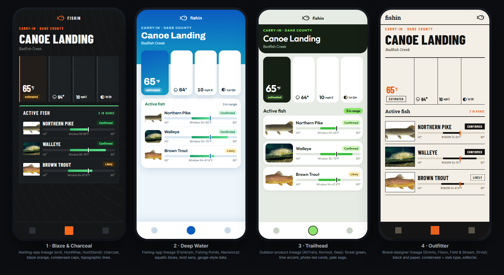

> **Expanded for an information-and-exploring app:** see [`style_board_info.md`](style_board_info.md), which studies field guides, nature-ID apps, encyclopedias and discovery products and adds four new directions.

# Style board: what real fishing, hunting and outdoor products look like

The earlier [six-style exploration](style_directions.md) was invented from design-trend articles and did not land. This
board replaces it. It is built from the **actual screens and brand sites** of products anglers and hunters use, and from
designer case studies. Third-party screenshots were studied but are **not stored in this repo**; each app below links to its
App Store page so you can look at the real thing. The four phones above are original mock-ups of the Spot screen in styles
derived from what the board shows. The live version is [`style_board_directions.html`](style_board_directions.html).

## What was studied

| Group | Products | How |
|---|---|---|
| **Fishing apps** | [Fishbrain](https://apps.apple.com/us/app/fishbrain-fishing-app/id477967747) (4.66★, 74k ratings), [Fishing Points](https://apps.apple.com/us/app/fishing-points-map-forecast/id1203032512) (4.66★, 31k), [Fish Deeper](https://apps.apple.com/us/app/fish-deeper-fishing-app/id1483380086), [Fishing Forecast](https://apps.apple.com/us/app/fishing-forecast/id6502960575), [Fishidy](https://apps.apple.com/us/app/fishidy-fishing-maps-app/id561498932), [ANGLR](https://apps.apple.com/us/app/fishing-app-anglr-logbook/id1142347232), [Navionics](https://apps.apple.com/us/app/navionics-boating/id744920098) | Their published App Store screens, side by side; colours measured from the pixels |
| **Hunting apps** | [onX Hunt](https://apps.apple.com/us/app/onx-hunt-gps-hunting-maps/id672902340) (4.89★, **274k ratings**), [HuntWise](https://apps.apple.com/us/app/huntwise-a-better-hunting-app/id645518545) (4.66★, 68k), [HuntStand](https://apps.apple.com/us/app/huntstand-gps-maps-tools/id778772892) (4.60★, 59k) | Same |
| **Outdoor and data products** | [AllTrails](https://apps.apple.com/us/app/alltrails-hike-bike-run/id405075943) (4.89★, **1.04M ratings**), [Gaia GPS](https://apps.apple.com/us/app/gaia-gps-mobile-trail-maps/id1201979492), [Windy](https://apps.apple.com/us/app/windy-com/id1161387262) (4.82★, 79k), Komoot | Same, plus site theme colours and fonts |
| **Brand and editorial designers** | Simms, Filson, Orvis, YETI, Patagonia, Field & Stream, Outdoor Life, MeatEater, Fishbrain and HuntWise brand sites | Hero imagery, the fonts each site loads, declared theme colours |
| **Designer case studies** | Behance: [Rainy Fishy](https://www.behance.net/gallery/149893577) (weather for fishermen), [AquaTrack](https://www.behance.net/gallery/240708631) (fishing app), [SEADEPTH](https://www.behance.net/gallery/244701619) (marine maps), OceanCast identity | Honest note: Behance search is noisy (mostly games and unrelated UI), so only four projects were truly on-topic |

## What the board shows

### 1. Each family has its own colour, and the colours are measured

| Family | Measured dominant colours (from screenshot pixels) | Reading |
|---|---|---|
| **Fishing apps** | Fishbrain `#0180bd` / `#96cae0`; Fishing Points `#1872c9`, `#2aaeef`, `#97e7fb`; Navionics `#053059`, `#12a0c4`; Fishing Forecast `#3296c7`, `#266d90` | Saturated **aquatic blue**, usually a cyan-to-deep-blue gradient behind the marketing and headers |
| **Hunting apps** | onX `#222222`; HuntStand `#1f201b`, `#000604`; HuntWise `#0d0c0c`, `#3b392f` with orange `#d36d1e` | **Charcoal / near-black**, earth olives and browns, one **blaze-orange** accent |
| **Outdoor products** | AllTrails `#151f14` (theme `#2b381f`) with pale sage `#e5eae6`; Komoot theme `#4f6814`; Gaia `#3c3f2c`, `#ece9d5`; Windy theme `#9d0300` | **Forest green** and cream, with a bright lime or a single brand hue |
| **Brands** | Simms black + orange; MeatEater, Outdoor Life and HuntWise orange; YETI navy; Orvis and Field & Stream lead with photography | **Black and paper plus one loud field colour** |

### 2. Type: condensed headlines, plain grotesque for data

| Site | Fonts it loads |
|---|---|
| Simms | Acumin Pro Extra Condensed Bold (headlines), Basis Grotesque Pro |
| Filson | Founders Grotesk X-Condensed and Founders Grotesk Mono |
| Field & Stream | ITC Franklin Gothic Demi Compressed and Clarendon (a slab serif) |
| Outdoor Life | Barlow and Source Sans 3 |
| Patagonia | Avenir Next |
| Komoot | Satoshi and Nohemi (geometric, friendly) |
| onX / HuntWise (in-store art) | Heavy condensed all-caps |

The pattern: **tall condensed all-caps display type** for names and headlines (hunting and heritage brands), a **clean geometric
or neo-grotesque sans** for data (fishing and trail apps), and occasionally a **slab serif** for a heritage feel.

### 3. The signature fishing-app visual is a range or activity chart

Fishbrain's BiteTime bar chart, Fishidy's green-to-red "Extremely Active" curve, Fishing Points' 87 activity dial and
tide curve, Fishing Forecast's red / yellow / green band, HuntWise's percentage tiles with green and yellow chips. They are
all scores, and **we cannot show a bite score** (DECISIONS #005). But the same visual language works with our real data:
a **temperature-window bar** per species, with the documented range highlighted and today's temperature marked. It is
instantly readable, uses only sourced numbers, and is drawn in all four mock-ups above.

### 4. Other patterns that recur

- **Map first.** Satellite, bathymetric contour lines (Navionics, Fish Deeper) and topographic lines (onX, Gaia, ANGLR) are the hero
  and often the background texture.
- **Real photography over illustration.** Anglers holding real fish (Field & Stream, Orvis, Fishbrain, AllTrails trail cards). We
  have real public-domain fish photos, which suits this.
- **Big numerals.** Weather and depth readouts are large and tabular (Fish Deeper's `8.2`, Fishing Points' `87`, `1.16 ft`).
- **Traffic-light chips** for status (HuntWise green 100% / yellow 54%). We already have Confirmed / Likely chips.
- **Dark mode is standard** in hunting and marine apps (Navionics has a dedicated night mode), light in trail apps.
- **Floating bottom sheets** for detail over a map (onX, HuntStand).

## Four directions taken from the board

| | Direction | Lineage | Palette | Type | Distinct idea |
|---|---|---|---|---|---|
| **1** | **Blaze & Charcoal** | onX, HuntWise, HuntStand | `#141618` charcoal, `#ff6a1a` blaze, `#5be08e` in-range green | Barlow Condensed caps + Barlow | Topographic-line background, condensed caps names, orange only for the primary reading |
| **2** | **Deep Water** | Fishbrain, Fishing Points, Navionics | `#0a5bbf` to `#12a0c4` blues, white cards, `#22a06b` green | Archivo | Blue gradient header, the Water tile as a hero gauge, rounded cards |
| **3** | **Trailhead** | AllTrails, Komoot, Gaia | `#151f14` forest, `#8be36b` lime, `#e6ebe4` sage | Outfit | Photo-led fish cards, dark hero over pale sage, lime accent |
| **4** | **Outfitter** | Simms, Filson, Field & Stream, Orvis | `#141414` black, `#f4efe6` paper, `#e8621c` orange | Barlow Condensed + Roboto Slab | Editorial: hairline rules, slab-serif headings, big plates, stamped tags |

All four keep Confirmed / Likely and real / estimated / proxy legible without relying on colour alone, and none uses a bite score.

## Watch-outs (from our own constraints)

- **Orange collides with our amber "Likely".** In directions 1 and 4, "Likely" must move to a different treatment (dashed outline, as
  in 4) so orange can mean "primary reading" only.
- **Fonts.** Several sites use paid fonts (Acumin, Founders Grotesk, Basis). The mock-ups use free look-alikes (Barlow Condensed,
  Archivo, Outfit, Roboto Slab, all open-license), which is what we would ship.
- **Photos.** Our fish photos sit on white or pale backgrounds. Directions 3 and 4 make them the star; 1 and 2 keep them small.
- **Dark and light.** 1 is dark-native, 2 and 3 are light-native with a natural dark twin, 4 is light-native and would need a
  "night paper" variant.

## Suggested next step

Pick the one or two directions that feel closest, and say what to keep or change ("Trailhead's cards, Blaze's type"). I will build
the chosen direction as a theme on the real app, so you judge it on your own phone, not in a picture.

*Sources for figures: App Store listing data (ratings and counts as of today), pixel sampling of the store screenshots, the fonts
and theme colours declared by each site, and the Behance project pages linked above.*
