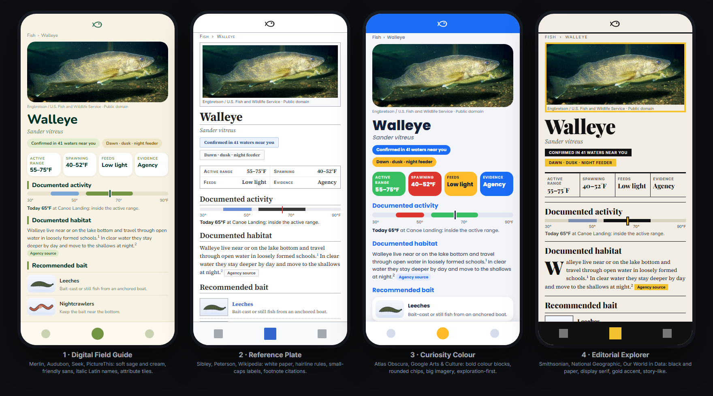

# Style board, expanded: an app for information and exploring

[`style_board.md`](style_board.md) looked at fishing, hunting and outdoor apps, which are mostly about *doing* (navigating,
logging catches, planning a hunt). fishin is different: it is for **learning what is in the water and exploring where to look**.
So this expansion studies the products people use to *understand and discover*: field guides, nature-ID apps, encyclopedias,
discovery and museum apps, editorial and data-journalism sites, and the government and university reference sites in our own domain.
As before, third-party screenshots were studied but are not stored in the repo; every product links to its store page. The four phones
above are original mock-ups of the **Fish** screen, which is our most information-dense one. The live file is
[`style_board_info_directions.html`](style_board_info_directions.html).

## What was studied

| Group | Products |
|---|---|
| **Field guides and nature-ID** | [Merlin Bird ID](https://apps.apple.com/us/app/merlin-bird-id-by-cornell-lab/id773457673) (4.86★, 112k ratings), [Seek](https://apps.apple.com/us/app/seek-by-inaturalist/id1353224144) (4.75★, 31k), [Audubon Bird Guide](https://apps.apple.com/us/app/audubon-bird-guide/id333227386), [Sibley Birds](https://apps.apple.com/us/app/sibley-birds-2nd-edition/id1236011411) (4.88★), [Fieldguide](https://apps.apple.com/us/app/fieldguide-for-everything/id879829383), [PictureThis](https://apps.apple.com/us/app/picturethis-plant-identifier/id1252497129) (4.80★, **1.1M ratings**) |
| **Fish reference** | [FishVerify](https://apps.apple.com/us/app/fishverify-id-regulations/id1121514756), [Catchr](https://apps.apple.com/us/app/catchr-fish-identifier/id6744193660) |
| **Encyclopedia and discovery** | [Wikipedia](https://apps.apple.com/us/app/wikipedia/id324715238), [Atlas Obscura](https://apps.apple.com/us/app/atlas-obscura-travel-guide/id1563250221) (4.85★), [Google Arts & Culture](https://apps.apple.com/us/app/google-arts-culture/id1050970557) (4.68★, 134k) |
| **Editorial and data storytelling** | [Smithsonian Magazine](https://apps.apple.com/us/app/smithsonian-magazine/id484193368), National Geographic, [The Pudding](https://pudding.cool/), [Our World in Data](https://ourworldindata.org/), Pentagram |
| **Reference sites in our own domain** | Cornell Lab, [Audubon](https://www.audubon.org/), Wisconsin DNR, Minnesota DNR, UW Sea Grant, USFWS, FishBase |
| **Design critique and principles** | [IXD@Pratt critique of Merlin](https://ixd.prattsi.org/2023/09/design-critique-merlin-bird-id-app/); Nielsen Norman Group on [progressive disclosure](https://www.nngroup.com/articles/progressive-disclosure/); [small multiples](https://www.visualizing.org/small-multiples); faceted search best practice ([Fact-Finder](https://www.fact-finder.com/blog/faceted-search/), [LogRocket](https://blog.logrocket.com/ux-design/advanced-ux-search-principles/)) |

## What the board shows

### 1. A species is presented the same way everywhere

Merlin, Sibley, Audubon, Seek, FishVerify and Catchr all lead a species with: **a large clean photo or plate, the common name in bold,
the Latin name in italics, and one or two status chips** ("Native", "Confirmed", "Open season"). Merlin's list rows add a **thin month-by-month
strip under each bird** (*J F M A M J J A S O N D*), and Sibley shows monthly status as a letter-coded grid. This is the single most reusable
convention for us: our rows already have photo, name and a Confirmed / Likely chip. Adding the Latin name and a **documented-range strip** matches the
category's language exactly.

### 2. Facts live in a labelled grid, not in prose

PictureThis' care guide is a grid of **icon + label + value tiles** (sun needs, temperature range, watering interval). Fieldguide and Sibley use
**small-caps field labels** (COMMON NAME, SCIENTIFIC NAME, LENGTH, WEIGHT, STATUS). Fish reference apps add a **rule banner** (FishVerify's green
OPEN SEASON, bag limit, minimum size). The Fish screen's "Active range / Spawning / Feeds / Evidence" belongs in exactly this shape.

### 3. Palettes are calm and natural in field guides, loud in discovery apps

| Product | Measured dominant colours |
|---|---|
| Merlin | `#739442` sage, `#99ac5e`, `#f1e23f` (bird yellow), white |
| Seek | `#1a5b42` forest, `#38976e`, white |
| Audubon | `#00332a` deep green, `#fff9ef` cream, `#7d9c59`, `#0f74a9` |
| PictureThis | `#00a362` green, white, warm brown accents |
| FishVerify | `#629aa9` teal, `#2367b6` blue, `#fc611c` orange, `#ffb493` |
| Sibley | `#769ec4` sky blue, white |
| Atlas Obscura | `#a20b31` crimson, `#016b5c` green, `#fcac02` gold, `#055499` blue (one saturated colour per screen) |
| Google Arts & Culture | `#1b6df5`, `#ffbb2a`, `#37be60`, `#dd362e` (four primaries as category colours) |
| Smithsonian / NatGeo | black and paper with one accent (NatGeo yellow) |
| Our World in Data | deep navy with gold headings |

Field guides use **muted greens and cream** and let the photography carry the colour. Discovery products use **one bold colour per section or
category** to make browsing feel like play.

### 4. Type: serif for reading, sans for interface, italic for Latin

| Site | Fonts it loads |
|---|---|
| Audubon | Gotham Narrow with Abril Text (serif) |
| Atlas Obscura | Platform (sans) with Freight Text Pro (serif) |
| The Pudding | Tiempos Text (serif), Atlas Grotesk, Atlas Typewriter |
| Google Arts | Google Sans |
| Our World in Data | Lato with a serif for titles |
| Wisconsin DNR | Fira Sans, Raleway, Anton |
| Minnesota DNR | Open Sans |
| UW Sea Grant | Red Hat Display / Red Hat Text |
| Smithsonian, NatGeo | Display serifs, drop caps, condensed caps |

Editorial and reference sites pair a **readable serif for long text** with a **clean grotesque for controls and labels**. Every biology
product sets **Latin names in italics**.

### 5. Exploration patterns that recur

- **Search first, then filter chips** (Google Arts' topic chips; Audubon's "Name or Scientific Title" search). Faceted filtering works best when facets
  appear only when they apply.
- **Map and list as twin views of the same set** (Atlas Obscura: clustered pins, then a bottom card; a "been here / want to go" pair).
- **Progressive disclosure:** summary first, detail on demand (Merlin's card sections; Nielsen Norman Group's guidance to reveal information when it is
  relevant). Our Spot page's three buttons already do this.
- **Small multiples:** the same small chart repeated per item on an identical scale so items can be compared at a glance, which is what Merlin's strip
  does and what a documented-range meter per species would do for us.
- **Citations as first-class content:** Wikipedia's numbered footnotes, Sibley's sourced status text. Ours are already stronger than most; the design
  should present them as footnotes instead of hiding them.
- **Real imagery:** photos and plates first; illustrations only where no photo exists.

### 6. Design critique of the category leader

The Pratt critique of Merlin praises its **pastel, nature-recalling palette**, **grey text that reduces eye strain**, a **four-part bottom bar**
(Identify, Explore, Life List, Settings), **card sections** for dense information, and **text paired with images**. It criticises **icon-less options**,
missing progress feedback, and a **results page with too many clickable elements**. Lesson for us: cards and calm colour work; keep every list row to
one obvious tap target.

## Four directions taken from this board

| | Direction | Lineage | Feel | Key idea |
|---|---|---|---|---|
| **1** | **Digital Field Guide** | Merlin, Audubon, Seek, PictureThis | Warm cream and sage, friendly rounded sans, italic Latin | Attribute tiles, the documented-activity meter, sage section rules |
| **2** | **Reference Plate** | Sibley, Peterson, Wikipedia | White paper, serif text, hairline rules, small-caps labels | A framed plate, a fact table, numbered footnote citations |
| **3** | **Curiosity Colour** | Atlas Obscura, Google Arts & Culture | Bold colour blocks, rounded chips, big imagery | One colour per fact type (range green, spawning red, feeding gold), exploration-first |
| **4** | **Editorial Explorer** | Smithsonian, NatGeo, Our World in Data, Pentagram | Black and paper, display serif, gold frame, drop cap | Reads like a magazine feature; the data is part of the story |

The **documented-activity meter** (the species' range highlighted, spawning shown separately, and today's temperature marked) appears in all four. It is our
version of Merlin's month strip and the fishing apps' activity chart, built from sourced numbers and never a bite score (DECISIONS #005).

### How they hold up against our constraints

- **Honest labelling:** the tags (Confirmed / Likely, real / estimated / proxy) stay chips in 1 and 3, become outlined or stamped labels in 2 and 4. Nothing depends on colour alone.
- **Photos on white:** 2 (framed plate) and 4 (gold frame) make our pale-background public-domain photos look intentional; 1 and 3 round them.
- **Dark mode:** 1 and 3 have natural dark twins (deep green, midnight blue); 2 and 4 are paper-first and would need a designed "night paper" variant.
- **Effort (my estimate):** 1 small to medium; 2 small (fewest effects, mostly type and rules); 3 medium (more colour logic); 4 medium (display type and layout).

## Recommendation

For an app whose value is **trustworthy information plus discovery**, I would start from **1 (Digital Field Guide)** and borrow two things:
**Reference Plate's numbered footnote citations** (turning our sourcing into a visible strength) and **Curiosity Colour's one-colour-per-fact idea** in a
muted form for the fact tiles. If you want a more distinctive, premium personality, **4 (Editorial Explorer)** is the strongest identity, and it
suits a product that publishes a decision log and sources everything.

## One data idea this board suggests (needs a decision, not built)

Merlin's month strip works because it shows *when* a bird is around. We have real historical water-temperature records for many gauges. Comparing
them with a species' documented window could show **"months this water is typically inside the range"**, a descriptive climate strip, not a forecast.
That would need history data prepared per gauge and a review against #005 (it must read as history, not prediction). Flagging it as an option only.

## Next step

Tell me which direction (or which pieces of which) feels right. I will build it as a real theme on the app so you can judge it on your own phone.
