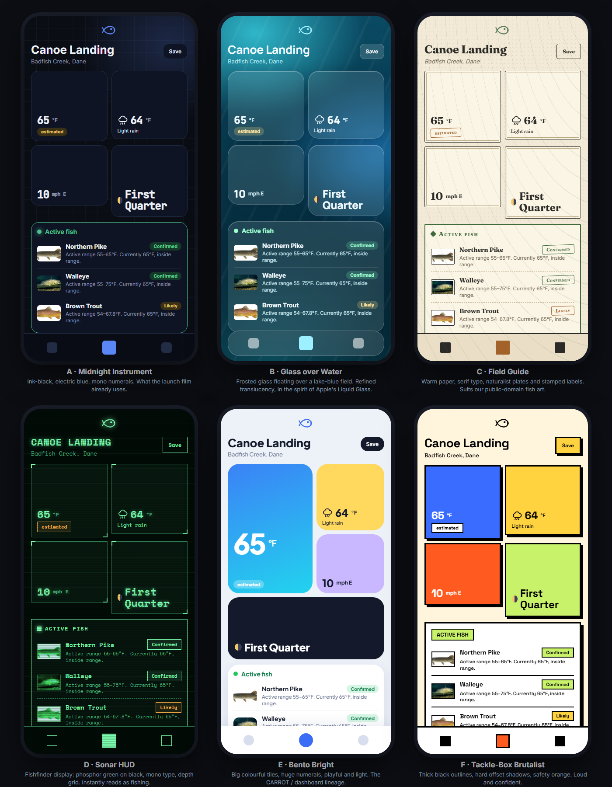

> **Superseded.** These six styles were invented from trend articles and were not liked. See [`style_board.md`](style_board.md), built from real fishing, hunting and outdoor products and designer work.

# Style directions: making fishin look cool

The image above is the real Spot screen (Canoe Landing, real species, real photos) rendered in six visual directions.
The live, editable version is [`style_lab.html`](style_lab.html); open it in a browser. Nothing here has been applied to
the app yet. This page is the research, an honest assessment of each direction, and a recommendation.

## What the research says

Sources are general design-trend write-ups, not studies of fishing apps, so treat them as a map of the landscape and not
as proof that any one style wins.

- **Dark is the primary surface now, not an option.** Designers treat dark mode as the main canvas, and OLED phones
  spend no power on true black ([Muzli](https://muz.li/blog/whats-changing-in-mobile-app-design-ui-patterns-that-matter-in-2026/),
  [Tech-RZ](https://www.tech-rz.com/blog/dark-mode-ui-design-in-2026-user-experience-and-ai-powered-interfaces/)). We already ship dark, and anglers
  are often on a phone at dawn or dusk.
- **Nature-inspired styles are grounded, not decorative:** organic shapes, muted sage / terracotta / sand palettes and
  tactile texture "convey honesty and balance" ([Envato](https://elements.envato.com/learn/graphic-design-trends),
  [Fairwind](https://fairwindcreative.com/blog/neo-naturalism-the-down-to-earth-graphic-design-trend-defining-2026/)). Outdoor map products lean on
  hillshading and topography for a tactile feel ([Mapbox](https://www.mapbox.com/maps/dark)).
- **Bento layouts suit exactly our content.** Modular rounded tiles of different sizes, with the big tile drawing the eye
  first, are described as ideal for weather metrics and dashboards
  ([Brucira](https://blog.brucira.com/top-ui-design-trends/), [Rajesh Nair](https://rajeshrnair.com/blog/design/ui-ux/ui-design-trends-2026-bento-grids-glassmorphism.html)).
- **Glass works only in moderation.** The 2026 consensus is subtle translucency on layers that float (bars, sheets, cards) and
  not on dense text, where it "kills readability fast". Apple's Liquid Glass and AllTrails' floating glass buttons are the
  reference ([Apple](https://developer.apple.com/design/new-design-gallery-2026), [Memorisely](https://www.memorisely.com/ui-design-inspiration/all-trails-ios-app)).
- **Personality is what makes data apps memorable.** CARROT Weather is remembered for character, small reactive
  illustrations (trees and smoke that respond to wind) and staggered, springy motion, on top of a clear vertical layout
  ([CARROT](http://www.meetcarrot.com/weather/v5.html), [60fps.design](https://60fps.design/apps/carrot)).
- **Neo-brutalism** signals authenticity and confidence with thick outlines and hard shadows, and suits younger, louder brands
  ([Brucira round-up](https://blog.brucira.com/top-ui-design-trends/)).

## Our constraints (these decide more than trend does)

1. **The tags are the product.** *Real / estimated / air-temperature proxy* and *Confirmed / Likely* must stay instantly
   distinguishable and readable (WCAG AA), and never rely on colour alone.
2. **Both themes.** Any style needs a light and a dark version, or an honest decision to be dark-only.
3. **Public-domain fish photos** are mostly shot on white or pale backgrounds. A style has to make them look intended.
4. **Voice.** "Calm, exact, confident about the method, humble about the outcome." Loud or playful styles fight that.
5. **Phones outdoors.** Heavy blur effects cost battery and frame rate on low-end devices, and sun glare punishes low contrast.
6. **Cheap to change.** The app's colours are CSS tokens (about 64), so a reskin is mostly token values plus a few components.
   The CSS notes the blue brand was a deliberate earlier direction, so leaving blue is a decision to make, not a default.

## The six directions

| | Direction | Feels like | Strengths | Risks | Fit | Effort (my estimate) |
|---|---|---|---|---|---|---|
| **A** | **Midnight Instrument** | A precision instrument: ink-black, electric blue, mono numerals, faint grid | Already the launch film's look; strong tag contrast; reads as "data you can trust"; OLED-friendly | Can feel cold; least "fishing" | High | Small: mostly tokens |
| **B** | **Glass over Water** | Looking through a lake: frosted cards floating over teal water | Very current; premium; ties to the subject | Blur costs performance; text on translucency can fail contrast; hard to keep tags AA | Medium (good for the bottom bar and sheets only) | Medium |
| **C** | **Field Guide** | A naturalist's plate book: warm paper, serif, stamped labels | Makes our public-domain fish art look native; warm and trustworthy; strongly different from every competitor | Light-first, so dark needs a separate "night field guide"; more custom components (frames, textures) | High for Fish pages, medium overall | Medium-large |
| **D** | **Sonar HUD** | A fishfinder screen: phosphor green on black, mono type, corner brackets | Instantly says fishing; great for numerals and the temperature window | Photos need a filter hack; green-on-black is tiring for long reading and hard to keep dual-theme | Medium (accents, not the whole app) | Medium |
| **E** | **Bento Bright** | A friendly dashboard: big coloured tiles, huge numbers | Best hierarchy for Water / Air / Wind / Moon; approachable; matches the "weather metrics" pattern | Playful colour fights "evidence" tone; colour-coding must not clash with our green / amber tag meanings | Medium | Medium-large (layout change) |
| **F** | **Tackle-Box Brutalist** | A painted tackle box: thick outlines, hard shadows, safety orange | Unforgettable; confident | Loud for dense text; orange / yellow collide with our amber "Likely"; hardest to keep calm | Low | Medium |

## Recommendation

**Build A as the base and borrow the best of C and D, rather than picking one whole style.**

1. **Base: Midnight Instrument (A).** It is the cheapest, it already matches the film and README, and it protects the tags.
2. **Fish pages: Field Guide plates (from C).** Frame each public-domain photo as a plate with a serif species name and a small-caps
   "Documented activity" label. This is where the art is largest and where the warmth pays off, and it is the one place a
   serif adds trust.
3. **Numbers: Sonar readouts (from D).** Use mono numerals and thin corner brackets on the temperature window and the
   Water / Air tiles. It signals fishing without theming the whole app.
4. **Chrome only: glass (from B).** Frosted bottom bar and the three-button sheet, nothing that carries paragraphs of text.
5. **Layout: keep the drawn wireframe.** Take from E only the idea that Water is the big tile and the rest are small.
6. **Motion (the CARROT lesson):** small, meaningful reactions, such as the wind number nudging a reed icon or the
   Active / Inactive boxes settling in with a short stagger, kept subtle and off by default for reduced-motion.

If you want one bold, memorable identity instead of a hybrid, **C (Field Guide)** is the strongest differentiator, because
nothing else in this category looks like it, and it turns our biggest asset (real, sourced fish art) into the style.

## Proposed next step (no commitment)

Build the styles as **selectable themes driven by tokens** (a `data-style` attribute next to the existing light/dark switch), so
you can flip between A, the hybrid and C live on the real app, on your own phone, before choosing. Each needs its tag
contrast checked with the same measurement the dark-mode fix used, and the existing theme-scoping test already guards
against one theme's rules leaking into another.

Open questions for you: keep blue as the brand colour? Dark-first, or equal light and dark? And how much personality
(illustration, motion) fits a product whose whole promise is "we report, we don't hype"?
